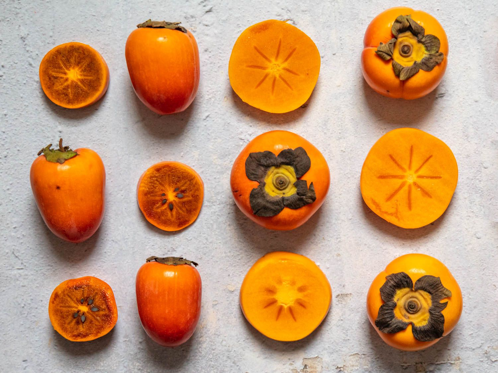

## Some pictures! 
These are *persimmons*, which I'm craving right now. 

This is a picture of **margherita pizza**, I just thought it looked delicious. 

I'm also kinda craving pizza.

>Once upon a time I ate margherita pizza. 

Today I learned more about the command
`git checkout`
because I'm not that experienced with working with branches in git. 
I found out more about this command through [this page](http://guides.beanstalkapp.com/version-control/common-git-commands.html).

I've also had a busy week, mostly because of my busy schedule due to my sorority and [recruitment](#my-week-of-recruitment). 

Onto more about to this repo though, I created a [README](README.html) if you want to learn more! 

The classes I'm taking this quarter include: 
* MGT 167: Social Entrepreneurship 
* CSE 110: This Class! 
* CSE 101: Algorithms 
* CSE 158: Data mining and Recommender Systems

Ranking of my favorite things to cook so far: 
1. Sunny-Side Up Eggs 
2. Pasta 
3. Thai Curry

My goals for this quarter
- [ ] find a job maybe
- [ ] organize oball
- [ ] be happy with my friends and family 

## My Week of Recruitment
It's been such a busy week! Lots of new people to talk to though so that's been refreshing but also a bit stressful, because I've gotten pretty comfortable being around people that I already know. 

